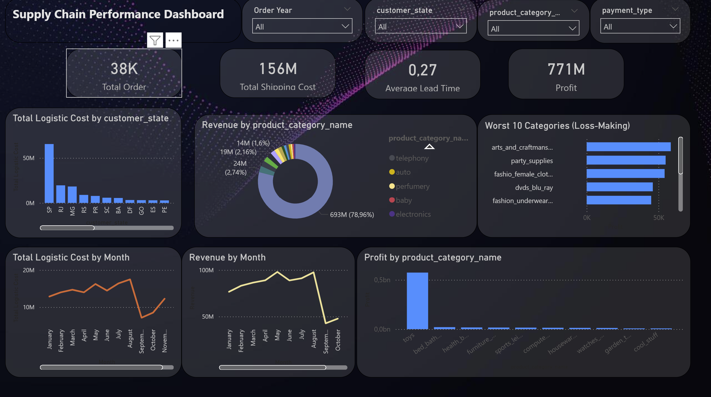
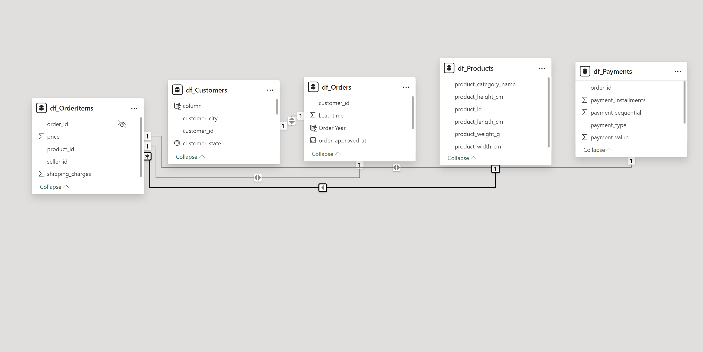

# Supply Chain Profitability & Logistics Dashboard (Power BI)

This project is an end‑to‑end Supply Chain Analytics Dashboard built using the Olist e‑commerce dataset.  
It provides a complete view of operational and financial performance across orders, logistics, products, and customer behavior.

The dashboard highlights key KPIs, profitability insights, cost‑to‑serve analysis, and category‑level performance to support data‑driven decision‑making in supply chain and operations roles.

---

## 📊 Dashboard Preview

---

## 📌 Key KPIs
- **Total Orders**
- **Total Revenue**
- **Total Logistic Cost**
- **Total Profit**
- **Profit %**
- **Average Lead Time**
- **Products Sold**

---

## 📊 Visuals Included

### **1. Profitability Analysis**
- Profit by Product Category  
- Worst 10 Loss‑Making Categories  
- Cost‑to‑Serve %  
- Profit % Trend  

### **2. Revenue & Cost Trends**
- Revenue by Month  
- Logistic Cost by Month  
- Revenue by Product Category  

### **3. Operational Insights**
- Total Logistic Cost by State  
- Lead Time  
- Payment Type Distribution  

### **4. Interactive Filters**
- Year  
- Customer State  
- Product Category  
- Payment Type  

---

## 🧩 Data Model

The data model follows a clean star‑schema structure with properly defined relationships across:

- Orders  
- Order Items  
- Products  
- Customers  
- Payments  

---

## 🔍 Insights Discovered
- Electronics category contributes the highest revenue.  
- Several categories operate at a **loss**, where logistic cost exceeds revenue.  
- Profitability varies significantly across product categories.  
- Logistic costs peak mid‑year, while revenue remains stable.  
- Certain states incur disproportionately high logistic costs.  

---

## 🛠 Tools Used
- **Power BI Desktop**
- **Power Query**
- **DAX (Data Analysis Expressions)**
- **Olist Public Dataset**

---

## 📥 How to Open the File
1. Download the `.pbix` file from this repository.  
2. Open it using **Power BI Desktop** (free).  
3. Interact with slicers and visuals to explore insights.

---

## 📎 Project Purpose

This project demonstrates:
- Data modeling skills  
- DAX measure creation  
- KPI design  
- Business understanding of supply chain & logistics  
- Dashboard storytelling and visualization  

It is suitable for roles in:
- Supply Chain Analytics  
- Business Intelligence  
- Data Analysis  
- Operations Management  

---

## 👤 Author
**Taha Hameed**

## 🎓 Education
**Bachelor of Business Administration (BBA)**  
Major: Supply Chain Management  
